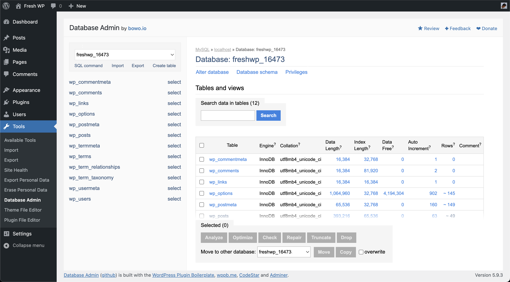
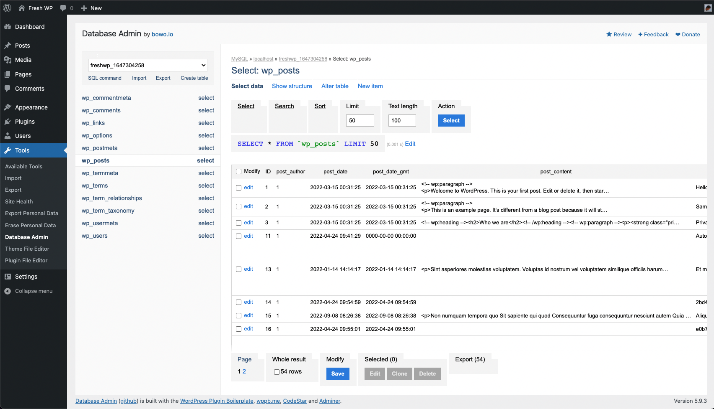
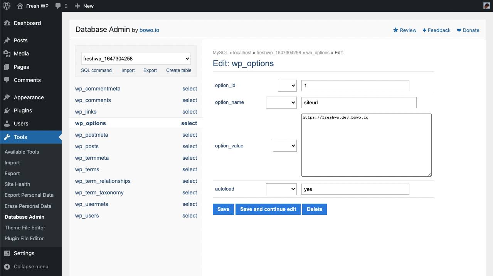

# Database Admin

Contributors: qriouslad  
Donate link: https://paypal.me/qriouslad  
Tags: database manager, adminer, mysql, mariadb, sql  
Requires at least: 4.8  
Tested up to: 6.0  
Stable tag: 1.1.0  
Requires PHP: 5.6  
License: GPLv2 or later  
License URI: http://www.gnu.org/licenses/gpl-2.0.html

Securely manage your website's database with a clean and user-friendly interface.

## Description

**Database Admin** allows you to manage your website's database securely with the full-featured [Adminer](https://www.adminer.org/), [an alternative](https://www.adminer.org/en/phpmyadmin/) to [phpMyAdmin](https://www.phpmyadmin.net/) that offers faster speed and a more intuitive user interface. 

### Give Back

* [A nice review](https://wordpress.org/plugins/database-admin/#reviews) would be great!
* [Give feedback](https://wordpress.org/support/plugin/database-admin/) and help improve future versions.
* [Github repo](https://github.com/qriouslad/database-admin) to contribute code.
* [Donate](https://paypal.me/qriouslad) and support my work.

## Screenshots

1. The main Database Admin page
   
2. Viewing the wp_posts table
   
3. Editing a record in the wp_options table
   

## Frequently Asked Questions

### How was this plugin built?

System Dashboard was built with: [WordPress Plugin Boilerplate](https://github.com/devinvinson/WordPress-Plugin-Boilerplate/) | [wppb.me](https://wppb.me/) | [CodeStar framework](https://github.com/Codestar/codestar-framework) | [Adminer](https://www.adminer.org/)

## Changelog

### 1.1.0 (2022.05.31)

* Fix text overflow issue in DB structure panel
* Enable plugin updates via [Git Updater](https://github.com/afragen/git-updater)

### 1.0.1 (2022.04.30)

* Fix: deprecated sanitize_url() function
* Fix: can not redeclare is_ajax() function
* Improvement: enable Adminer permanent login by default
* Improvement: several CSS styling changes for better consistency

### 1.0.0 (2022.04.24)

* Initial stable release

## Upgrade Notice

None required yet.